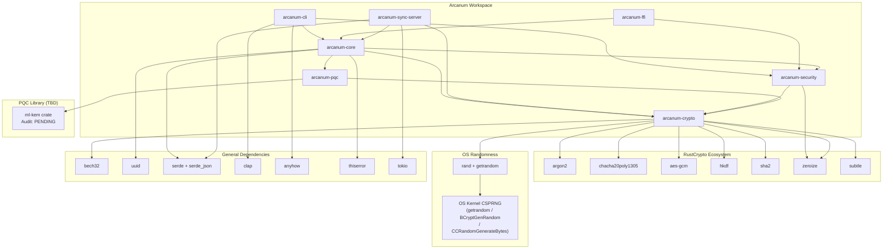

# Arcanum Supply Chain

**Status:** Living document — update on every dependency change  
**Related:** `docs/ops/dependency_risk_register.md`, ADR-011, ADR-012, ADR-013

---

## 1. Dependency Graph



---

## 2. Trust Tiers

| Tier | Definition | Crates |
|---|---|---|
| **T1 — Audited** | Independent security audit completed and published | `zeroize` (iqlusion 2020) |
| **T2 — Reviewed** | Extensive community review, test-vector verified, widely deployed | `sha2`, `hkdf`, `chacha20poly1305`, `aes-gcm`, `argon2`, `subtle`, `rand`/`getrandom` |
| **T3 — Evaluated** | Used in production, no known issues, community-maintained | `bech32`, `uuid`, `serde`, `clap`, `anyhow`, `thiserror`, `tokio` |
| **T4 — Pending** | Newer, lower audit history, requires active tracking | `ml-kem` (PQC — see ADR-012) |

---

## 3. Cryptographic Dependency Detail

| Crate | Tier | Ecosystem | Purpose | Audit / Notes |
|---|---|---|---|---|
| `zeroize` | T1 | RustCrypto | Secret buffer zeroization | Audited by iqlusion (2020) |
| `subtle` | T2 | dalek-cryptography | Constant-time operations | Reviewed; no formal audit |
| `sha2` | T2 | RustCrypto | SHA-256/384 | Reviewed; test-vector verified |
| `hkdf` | T2 | RustCrypto | HKDF-SHA256/384 | RFC 5869 compliance; reviewed |
| `chacha20poly1305` | T2 | RustCrypto | XChaCha20-Poly1305 AEAD | Reviewed; test-vector verified |
| `aes-gcm` | T2 | RustCrypto | AES-256-GCM (strict optional) | Reviewed; AES-NI backend |
| `argon2` | T2 | RustCrypto | Argon2id KDF | PHC reference impl in Rust |
| `rand` / `getrandom` | T2 | rust-random | OS CSPRNG delegation | Widely used; OS entropy sourced |
| `bech32` | T3 | Bitcoin ecosystem | Recovery secret encoding | BIP-173/350; no security audit |
| `ml-kem` | T4 | RustCrypto (new) | ML-KEM-768 PQC KEM | **No independent audit (2025-06)** |

---

## 4. Non-Cryptographic Dependency Detail

| Crate | Tier | Purpose | Risk |
|---|---|---|---|
| `serde` + `serde_json` | T3 | Serialization (non-secret metadata only) | Low — not used for secret data |
| `uuid` | T3 | UUID v4 generation | Low |
| `clap` | T3 | CLI argument parsing | Low — no secret values through argv |
| `anyhow` | T3 | Error handling (CLI/server) | Low |
| `thiserror` | T3 | Error type derivation | Low |
| `tokio` | T3 | Async runtime (sync server only) | Medium — large dependency surface |

---

## 5. OS Entropy Sources

| Platform | Entropy Source | Notes |
|---|---|---|
| Linux | `getrandom(2)` syscall | Blocks until entropy pool initialized |
| macOS | `CCRandomGenerateBytes` | SecureRandom framework |
| Windows | `BCryptGenRandom` | CNG (Cryptography Next Generation) |
| Android | `/dev/urandom` via getrandom | Kernel CSPRNG |
| iOS | `SecRandomCopyBytes` | Security framework |

Arcanum trusts the OS entropy source. A compromised OS kernel is documented
as out-of-scope in `specs/security/threat_model.md §5`.

---

## 6. Supply Chain Controls

| Control | Tool | Frequency |
|---|---|---|
| CVE scanning | `cargo audit` | Every commit |
| License and policy | `cargo deny` | Every commit |
| Unsafe code inventory | `cargo geiger` | Every commit (delta review) |
| Dependency trust chain | `cargo vet` | Before each release |
| SBOM generation | `cargo-cyclonedx` | Each beta and production release |
| Cryptographic dep review | Manual | Every version bump |
| Reproducible builds | Planned | Production release |

---

## 7. Known Gaps

```
[GAP-01] ml-kem crate has no independent security audit (2025-06)
         Mitigation: hybrid design, version pinning, audit tracking
         See: ADR-012, dependency_risk_register.md

[GAP-02] tokio has a large transitive dependency surface
         Mitigation: confined to arcanum-sync-server only
         crypto crates have zero tokio dependency

[GAP-03] bech32 has no formal security audit
         Risk: encoding/decoding correctness
         Mitigation: test-vector coverage, property tests

[GAP-04] Reproducible builds not yet implemented
         Target: production release
         See: docs/ops/release_checklist.md
```

---

## 8. Update Policy

This document must be updated when:
- Any dependency version changes in `Cargo.toml`
- An audit or review is published for any listed crate
- A new dependency is added
- A dependency is removed or replaced
- A CVE is filed against any listed crate
